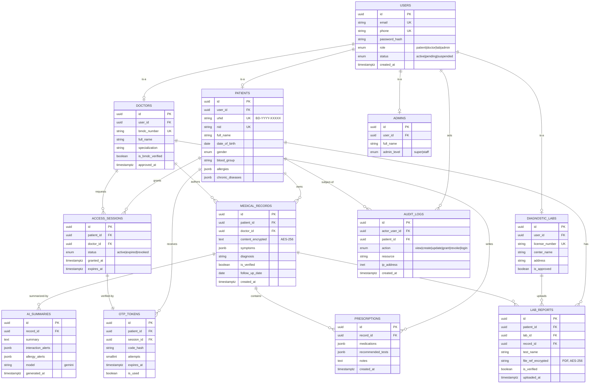

# 🗄️ HealthNexus BD — Database Design (ER + Schema)

**AI-Powered Unified Patient Health Record (UPHR) System for Bangladesh**
Project Manager deliverable · DB v1.0 · PostgreSQL

> Render tip: The ER block below is **Mermaid**. Paste it into <https://mermaid.live> or open in VS Code with the *Markdown Preview Mermaid Support* extension.

---

## 1. Design Principles

| Principle | How it is applied |
|-----------|-------------------|
| **Single identity, many roles** | `users` holds login/auth; role-specific data lives in `patients`, `doctors`, `diagnostic_labs`, `admins` |
| **Consent is explicit & session-scoped** | `access_sessions` + `otp_tokens` — a doctor gets a *time-boxed* grant, never permanent access |
| **Everything sensitive is auditable** | Every read/write on a record writes to `audit_logs` |
| **Verified vs Unverified data** | `medical_records.is_verified` — doctor/lab entries = verified, patient self-uploads = unverified |
| **Encryption at rest** | `medical_records.content` and `lab_reports.file_ref` stored AES-256 encrypted |
| **AI output is cached, not authoritative** | `ai_summaries` caches Gemini output linked to a record snapshot |

---

## 2. ER Diagram



---

## 3. Table Reference

### 3.1 `users` — base identity / auth
| Column | Type | Notes |
|--------|------|-------|
| id | UUID PK | |
| email | VARCHAR UNIQUE | login |
| phone | VARCHAR UNIQUE | OTP target |
| password_hash | VARCHAR | bcrypt/argon2 |
| role | ENUM | `patient`, `doctor`, `lab`, `admin` |
| status | ENUM | `active`, `pending`, `suspended` |
| created_at / updated_at | TIMESTAMPTZ | |

### 3.2 `patients`
UHID format `BD-YYYY-XXXXX`. `allergies` / `chronic_diseases` as JSONB for flexible clinical fields.

### 3.3 `doctors`
`is_bmdc_verified` set after the mock-BMDC check and admin approval; `approved_at` records when the admin cleared the registration.

### 3.4 `diagnostic_labs`
`is_approved` gate before the lab can upload reports.

### 3.5 `medical_records`
Core clinical entry. `content_encrypted` = AES-256. `is_verified = true` for doctor/lab, `false` for patient self-upload.

### 3.6 `access_sessions` + `otp_tokens` (the consent engine)
- Doctor requests access → row in `access_sessions` (status `active`, short `expires_at`).
- System issues `otp_tokens` (hashed code, `attempts` counter, expiry).
- On valid OTP → session confirmed; on expiry/max-attempts → session `revoked`.

### 3.7 `lab_reports`
Verified PDF reports linked to both patient and (optionally) the ordering `record_id`.

### 3.8 `ai_summaries`
Cached Gemini output + structured `interaction_alerts` / `allergy_alerts`. Never a source of truth — always regenerable.

### 3.9 `audit_logs`
Append-only. Powers the patient-facing "who accessed my data" view and admin monitoring.

---

## 4. PostgreSQL DDL (starter)

```sql
-- Enums
CREATE TYPE user_role   AS ENUM ('patient','doctor','lab','admin');
CREATE TYPE user_status AS ENUM ('active','pending','suspended');
CREATE TYPE session_status AS ENUM ('active','expired','revoked');
CREATE TYPE audit_action  AS ENUM ('view','create','update','grant','revoke','login');

-- Base identity
CREATE TABLE users (
    id            UUID PRIMARY KEY DEFAULT gen_random_uuid(),
    email         VARCHAR(255) UNIQUE NOT NULL,
    phone         VARCHAR(20)  UNIQUE NOT NULL,
    password_hash VARCHAR(255) NOT NULL,
    role          user_role   NOT NULL,
    status        user_status NOT NULL DEFAULT 'pending',
    created_at    TIMESTAMPTZ  NOT NULL DEFAULT now(),
    updated_at    TIMESTAMPTZ  NOT NULL DEFAULT now()
);

CREATE TABLE patients (
    id               UUID PRIMARY KEY DEFAULT gen_random_uuid(),
    user_id          UUID UNIQUE NOT NULL REFERENCES users(id) ON DELETE CASCADE,
    uhid             VARCHAR(20) UNIQUE NOT NULL,
    nid              VARCHAR(30) UNIQUE NOT NULL,
    full_name        VARCHAR(120) NOT NULL,
    date_of_birth    DATE,
    gender           VARCHAR(10),
    blood_group      VARCHAR(5),
    allergies        JSONB DEFAULT '[]',
    chronic_diseases JSONB DEFAULT '[]',
    created_at       TIMESTAMPTZ NOT NULL DEFAULT now()
);

CREATE TABLE doctors (
    id               UUID PRIMARY KEY DEFAULT gen_random_uuid(),
    user_id          UUID UNIQUE NOT NULL REFERENCES users(id) ON DELETE CASCADE,
    bmdc_number      VARCHAR(30) UNIQUE NOT NULL,
    full_name        VARCHAR(120) NOT NULL,
    specialization   VARCHAR(120),
    is_bmdc_verified BOOLEAN NOT NULL DEFAULT false,
    approved_at      TIMESTAMPTZ
);

CREATE TABLE diagnostic_labs (
    id             UUID PRIMARY KEY DEFAULT gen_random_uuid(),
    user_id        UUID UNIQUE NOT NULL REFERENCES users(id) ON DELETE CASCADE,
    license_number VARCHAR(50) UNIQUE NOT NULL,
    center_name    VARCHAR(150) NOT NULL,
    address        VARCHAR(255),
    is_approved    BOOLEAN NOT NULL DEFAULT false
);

CREATE TABLE medical_records (
    id                UUID PRIMARY KEY DEFAULT gen_random_uuid(),
    patient_id        UUID NOT NULL REFERENCES patients(id) ON DELETE CASCADE,
    doctor_id         UUID REFERENCES doctors(id),
    content_encrypted TEXT NOT NULL,
    symptoms          JSONB DEFAULT '[]',
    diagnosis         VARCHAR(255),
    is_verified       BOOLEAN NOT NULL DEFAULT true,
    follow_up_date    DATE,
    created_at        TIMESTAMPTZ NOT NULL DEFAULT now()
);

CREATE TABLE prescriptions (
    id                UUID PRIMARY KEY DEFAULT gen_random_uuid(),
    record_id         UUID NOT NULL REFERENCES medical_records(id) ON DELETE CASCADE,
    medications       JSONB DEFAULT '[]',
    recommended_tests JSONB DEFAULT '[]',
    notes             TEXT,
    created_at        TIMESTAMPTZ NOT NULL DEFAULT now()
);

CREATE TABLE lab_reports (
    id                 UUID PRIMARY KEY DEFAULT gen_random_uuid(),
    patient_id         UUID NOT NULL REFERENCES patients(id) ON DELETE CASCADE,
    lab_id             UUID NOT NULL REFERENCES diagnostic_labs(id),
    record_id          UUID REFERENCES medical_records(id),
    test_name          VARCHAR(150) NOT NULL,
    file_ref_encrypted TEXT NOT NULL,
    is_verified        BOOLEAN NOT NULL DEFAULT true,
    uploaded_at        TIMESTAMPTZ NOT NULL DEFAULT now()
);

CREATE TABLE access_sessions (
    id         UUID PRIMARY KEY DEFAULT gen_random_uuid(),
    patient_id UUID NOT NULL REFERENCES patients(id) ON DELETE CASCADE,
    doctor_id  UUID NOT NULL REFERENCES doctors(id),
    status     session_status NOT NULL DEFAULT 'active',
    granted_at TIMESTAMPTZ NOT NULL DEFAULT now(),
    expires_at TIMESTAMPTZ NOT NULL
);

CREATE TABLE otp_tokens (
    id         UUID PRIMARY KEY DEFAULT gen_random_uuid(),
    patient_id UUID NOT NULL REFERENCES patients(id) ON DELETE CASCADE,
    session_id UUID REFERENCES access_sessions(id) ON DELETE CASCADE,
    code_hash  VARCHAR(255) NOT NULL,
    attempts   SMALLINT NOT NULL DEFAULT 0,
    expires_at TIMESTAMPTZ NOT NULL,
    is_used    BOOLEAN NOT NULL DEFAULT false
);

CREATE TABLE ai_summaries (
    id                 UUID PRIMARY KEY DEFAULT gen_random_uuid(),
    record_id          UUID NOT NULL REFERENCES medical_records(id) ON DELETE CASCADE,
    summary            TEXT NOT NULL,
    interaction_alerts JSONB DEFAULT '[]',
    allergy_alerts     JSONB DEFAULT '[]',
    model              VARCHAR(40) NOT NULL DEFAULT 'gemini',
    generated_at       TIMESTAMPTZ NOT NULL DEFAULT now()
);

CREATE TABLE audit_logs (
    id            UUID PRIMARY KEY DEFAULT gen_random_uuid(),
    actor_user_id UUID NOT NULL REFERENCES users(id),
    patient_id    UUID REFERENCES patients(id),
    action        audit_action NOT NULL,
    resource      VARCHAR(120),
    ip_address    INET,
    created_at    TIMESTAMPTZ NOT NULL DEFAULT now()
);

-- Helpful indexes
CREATE INDEX idx_records_patient   ON medical_records(patient_id);
CREATE INDEX idx_sessions_active   ON access_sessions(doctor_id, status);
CREATE INDEX idx_otp_lookup        ON otp_tokens(patient_id, is_used);
CREATE INDEX idx_audit_patient     ON audit_logs(patient_id, created_at DESC);
```

---

### PM Notes
- **UHID & NID** are unique & indexed — primary patient lookup keys.
- **OTP codes are hashed** (never stored plaintext), with `attempts` + `expires_at` to enforce the lock/expiry logic from the Activity diagram.
- **`audit_logs` is append-only** — no UPDATE/DELETE in app layer (enforce via DB role/permissions later).
- Want me to also generate this as a **Prisma schema** or **Sequelize models** so it drops straight into a Node/Express backend? Or move to the **Class Diagram** next?
