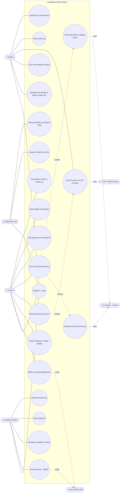
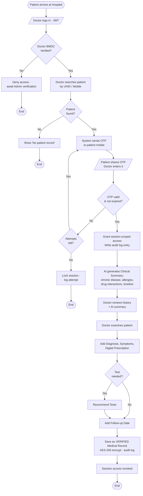

# 🏥 HealthNexus BD — UML Diagrams

**AI-Powered Unified Patient Health Record (UPHR) System for Bangladesh**
Project Manager deliverable · UML v1.0

> Render tip: These are **Mermaid** diagrams. They render automatically on GitHub and in VS Code with the *Markdown Preview Mermaid Support* extension. Paste any block into <https://mermaid.live> to export PNG/SVG.

---

## 1. Use Case Diagram

Actors: **Patient, Doctor, Diagnostic Lab, Hospital/Admin** (primary) and **AI Engine (Gemini), Mock BMDC, OTP/SMS Service** (secondary/support systems).



---

## 2. Activity Diagram — Doctor Consultation Flow (End-to-End)

Covers the full clinical journey: patient search → OTP consent → AI summary → consultation → verified record.



---

## 3. Sequence Diagram — OTP Consent → AI Summary → Verified Record

Lifelines: **Patient, Doctor, Frontend (React), Backend (Express), Database (PostgreSQL), OTP Service, AI Engine (Gemini)**.

```mermaid
sequenceDiagram
    autonumber
    actor P as 👤 Patient
    actor D as 🩺 Doctor
    participant FE as Frontend (React)
    participant BE as Backend (Express)
    participant DB as PostgreSQL
    participant OTP as OTP/SMS Service
    participant AI as AI Engine (Gemini)

    D->>FE: Login (email, password)
    FE->>BE: POST /auth/login
    BE->>DB: Verify credentials + BMDC status
    DB-->>BE: Doctor verified ✔ + JWT claims
    BE-->>FE: JWT (role: doctor)

    D->>FE: Search patient (UHID / mobile)
    FE->>BE: GET /patients?uhid=BD-2026-9941 (JWT)
    BE->>DB: Lookup patient
    DB-->>BE: Patient profile (minimal)
    BE-->>FE: Patient found

    D->>FE: Request record access
    FE->>BE: POST /consent/request-otp
    BE->>OTP: Send OTP to patient mobile
    OTP-->>P: SMS with OTP code
    P-->>D: Shares OTP verbally
    D->>FE: Enter OTP
    FE->>BE: POST /consent/verify-otp
    BE->>DB: Validate OTP (expiry, attempts)
    DB-->>BE: Valid ✔
    BE->>DB: Create session grant + audit log
    BE-->>FE: Access token (session-scoped)

    FE->>BE: GET /records/{uhid}/summary
    BE->>DB: Fetch full medical history (decrypt AES-256)
    DB-->>BE: History records
    BE->>AI: Summarize history + interaction/allergy check
    AI-->>BE: Clinical Summary + alerts
    BE-->>FE: Records + AI Summary
    FE-->>D: Display history + AI Clinical Summary

    D->>FE: Add diagnosis, prescription, tests, follow-up
    FE->>BE: POST /records (verified)
    BE->>DB: Store encrypted VERIFIED record + audit log
    DB-->>BE: Saved ✔
    BE-->>FE: 201 Created
    FE-->>D: Record saved · session closes
    Note over BE,DB: Access auto-revoked after session;<br/>Patient can view "who accessed" in Audit Log
```

---

### PM Notes
- **Naming:** All references updated to **HealthNexus BD**.
- **Consent model:** OTP grants **session-scoped** access only (per the spec) — reflected in all three diagrams.
- **Verified vs Unverified:** Doctor/Lab records = *Verified*; patient self-uploads = *Unverified* (shown in Use Case UC6/UC15). Want a dedicated activity diagram for the **Lab Upload** flow too? I can add it.
